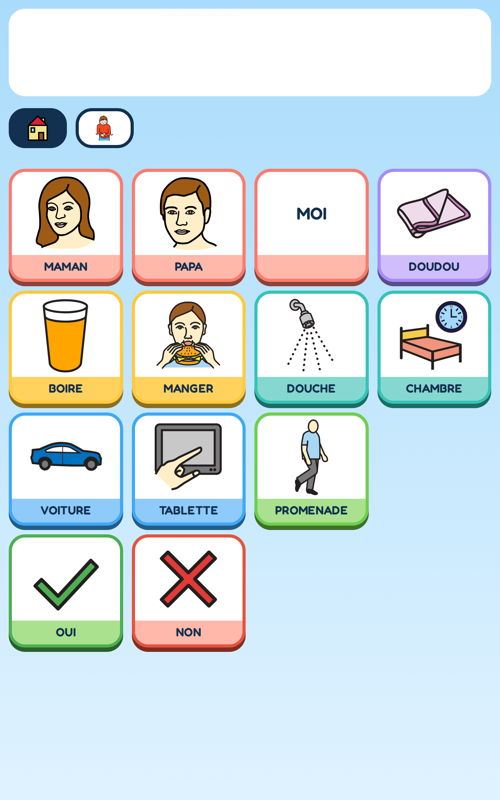
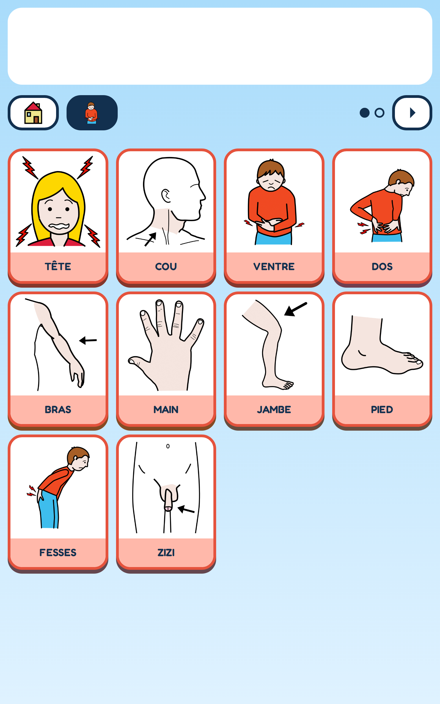
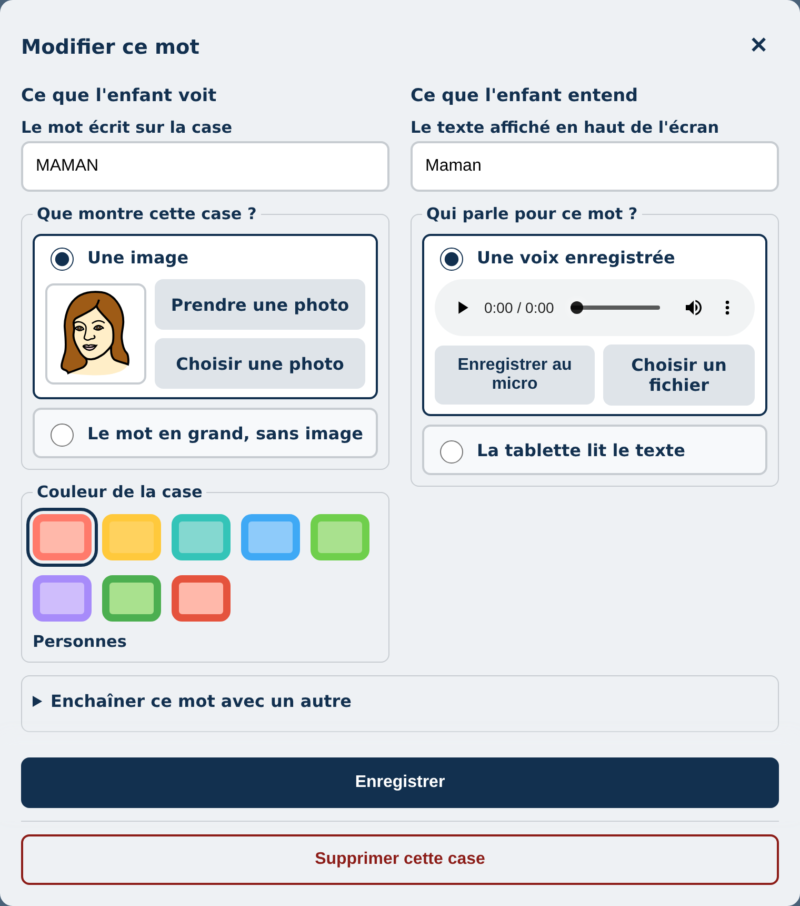
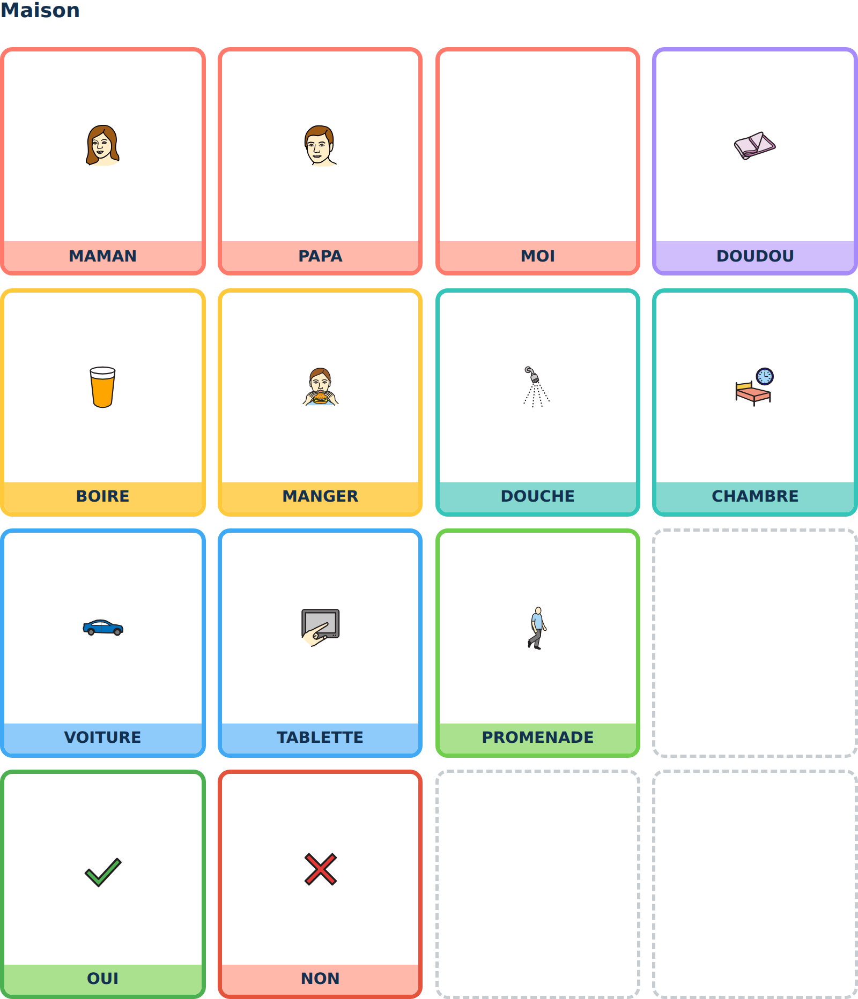

# Mes mots

Une application de communication par pictogrammes pour un enfant qui ne parle pas et qui ne
lit pas encore. Il touche une case, la tablette dit le mot.

Elle fonctionne hors ligne, s'installe depuis un lien, et **rien ne sort de l'appareil** :
pas de compte, pas de serveur, aucune donnée transmise.

**[Essayer dans le navigateur](https://ohugonnot.github.io/mes-mots/)** · [English](README.en.md)

| | |
|:--|:--|
|  |  |
| L'écran de l'enfant. Une case, un mot, une voix. | « J'ai mal », une case par endroit du corps. |
|  |  |
| L'espace parents : ce que l'enfant voit, ce qu'il entend. | La même planche sur papier, prête à imprimer. |

La notice destinée aux parents, vingt-quatre chapitres illustrés, est là :
**[docs/notice-famille.pdf](docs/notice-famille.pdf)**.

## Ce qu'elle fait

Une grille de cases, chacune avec son dessin et son mot. Un appui, une voix. En dessous,
quelques mondes : la maison, l'extérieur, « J'ai mal ». Une barre de mots essentiels qui ne
bouge jamais.

Le parent entre dans son espace par un appui long dans un coin, puis une addition à résoudre.
C'est là qu'il ajoute un mot, prend une photo, enregistre sa propre voix, range les cases,
imprime les planches sur papier, sauvegarde et restaure.

- **Les photos de la famille** remplacent les pictogrammes quand un visage parle mieux qu'un
  dessin.
- **La voix des proches** s'enregistre case par case. Un enfant reconnaît la voix de sa mère
  avant de reconnaître un mot.
- **« J'ai mal »** montre une case par partie du corps, ou deux corps dessinés à toucher, au
  choix du parent.
- **Les planches s'impriment** : la tablette tombe en panne, le papier non.
- **La sauvegarde** est un fichier `.obz` au format Open Board Format, lisible par d'autres
  applications de CAA.
- **Le journal du jour** dit au parent ce que l'enfant a demandé, avec l'heure, et s'efface à
  minuit. Aucune statistique, aucun comptage.

## Ce qui la distingue

Il existe déjà des applications de CAA libres et gratuites, sérieuses et vivantes : CBoard
(soutenu par l'UNICEF) et AsTeRICS Grid (université des sciences appliquées de Vienne).
Gratuit n'est donc pas la promesse. Voici ce qui l'est.

**Rien ne quitte l'appareil.** Pas de compte à créer, pas de serveur à qui parler, pas de
synchronisation. Les mots, les photos et les voix de la famille restent dans le navigateur de
la tablette. C'est aussi la contrepartie : il faut sauvegarder soi-même, et l'application le
rappelle.

**Une case ne change jamais de place.** Un enfant qui ne lit pas apprend par la position de
son doigt. Cette promesse n'est pas une intention : elle est tenue par des tests, et un banc
de mutation vérifie que ces tests mordent vraiment.

**C'est petit.** Une grille, des mots, des voix. Pas de domotique, pas de YouTube, pas de
tableau de bord. Une famille qui veut seulement qu'un doigt fasse un mot n'a rien à
traverser.

**Le français d'abord.** L'application, la notice pour les parents et les voix sont écrites en
français, avec une famille française.

## Ce qu'elle ne fait pas

Autant le dire tout de suite, parce que ça compte pour choisir.

Pas de commande oculaire ni de contacteur : elle s'utilise au doigt. Pas de vocabulaire de
plusieurs milliers de mots construit par des orthophonistes sur des années, comme en portent
Proloquo2Go, TouchChat ou LAMP Words for Life. Pas de grammaire ni de conjugaison : on pose
des mots, on ne construit pas des phrases complexes. Pas de synchronisation entre plusieurs
appareils, par choix.

Pour situer, les applications qui font tout cela coûtaient en 2026 de 150 à 300 $ sur iOS, et
jusqu'à 550 £ pour Grid 3 sur ordinateur. Si votre enfant a besoin de ce qu'elles font,
elles les valent. Celle-ci est pour l'autre cas : une grille simple, tout de suite, sans rien
avancer.

## Installer sur une tablette

Ouvrir le lien dans Chrome ou Edge, puis « Installer l'application » dans la barre d'adresse
ou le menu. Elle s'ouvre ensuite comme une application, sans barre de navigateur, et
fonctionne en mode avion.

Sur iPad, par « Partager » puis « Sur l'écran d'accueil ».

Une fois installée, elle ne redemande jamais le réseau, sauf pour se mettre à jour.

## Développer

```bash
npm install --ignore-scripts
npm run dev          # http://localhost:5173
npm run build        # la vraie version, service worker compris
npm run preview      # http://localhost:4173, la seule où l'installation se teste
```

Vue 3 et TypeScript, sans bibliothèque d'interface : le CSS est écrit à la main, composant par
composant. Les données suivent le format [Open Board Format](https://www.openboardformat.org/)
et vivent dans IndexedDB.

### Les tests

```bash
npm run typecheck
npx vitest run                 # la logique pure
npx playwright test            # les parcours dans le navigateur
./mutation.sh                  # la preuve que les tests mordent
```

Le dernier mérite un mot. Une suite verte ne prouve pas grand-chose : elle prouve que rien
n'a cassé, pas que quelque chose est vérifié. `mutation.sh` casse le code volontairement,
motif par motif, et vérifie qu'un test rougit à chaque fois. Un motif qui survit désigne un
test décoratif. C'est ce qui permet d'écrire plus haut qu'une case ne bouge jamais.

## Les pictogrammes

Les dessins viennent du jeu **Mulberry Symbols** de Steve Lee, sous licence
[CC BY-SA 4.0](https://creativecommons.org/licenses/by-sa/4.0/). Ils sont redistribués ici
tels quels, seulement renommés d'après le mot français de la case. Le détail est dans
[CREDITS.md](CREDITS.md).

Deux symboles, la coche et la croix, ont été dessinés pour l'application et suivent sa
licence.

## Licence

Code sous [AGPL-3.0](LICENSE). Vous pouvez l'utiliser, le modifier et le redistribuer. Si
vous en hébergez une version modifiée, vous devez en publier les sources.

Les pictogrammes Mulberry gardent leur licence CC BY-SA 4.0, qui ne s'étend pas au code.

## Avertissement

Ce n'est pas un dispositif médical, et ce n'est pas un traitement. Une application de
communication alternative se choisit et s'installe avec un orthophoniste, qui connaît l'enfant
et saura dire si une grille de pictogrammes lui convient, et lesquels.

Cette application a été écrite pour un enfant précis, sur les besoins que sa famille a
décrits. Elle est publiée parce qu'elle peut servir ailleurs, pas parce qu'elle conviendrait
à tous.

Il n'y a ni support garanti, ni feuille de route promise, ni engagement de répondre. Le
développement suit les besoins d'une famille, et rien d'autre. Beaucoup de projets d'aide
technique meurent de cette charge-là, pas du manque d'intérêt : autant le dire franchement
plutôt que de laisser espérer. Les issues restent ouvertes, les contributions bienvenues,
et la licence vous laisse reprendre le projet si je m'arrête.
